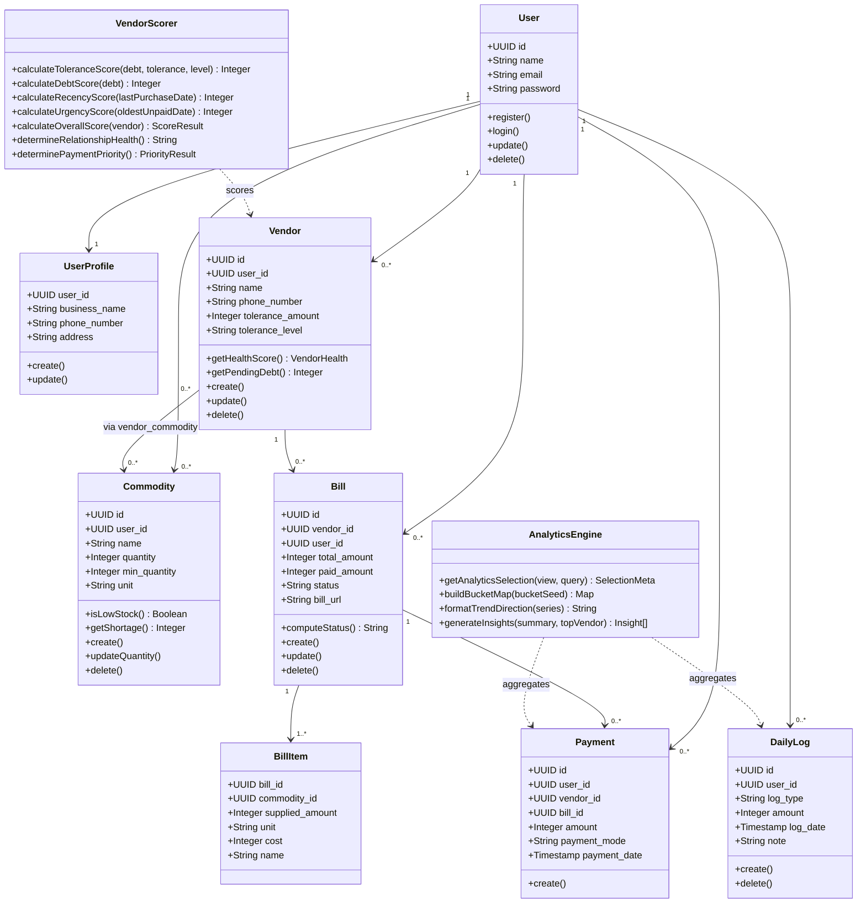
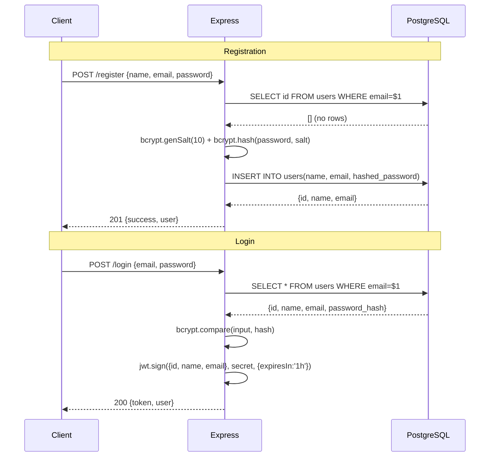
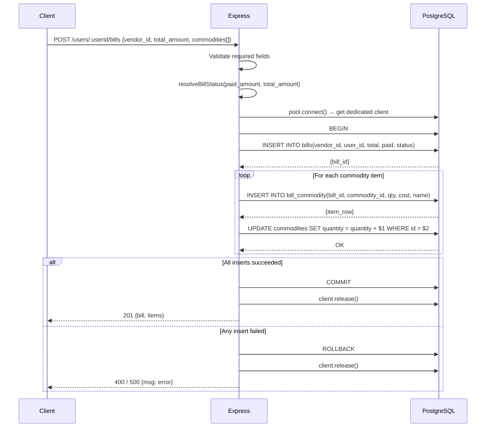
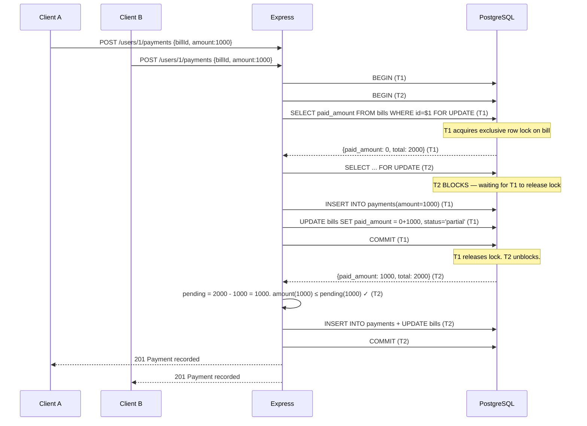
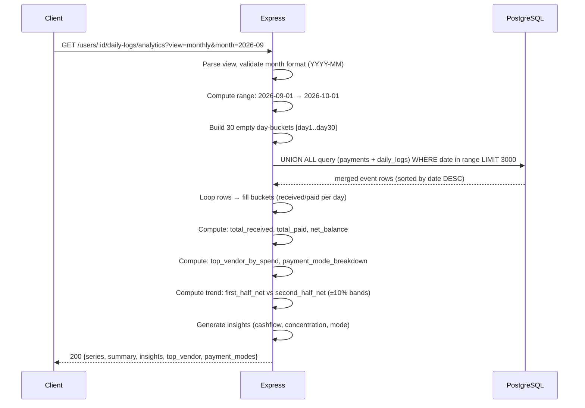
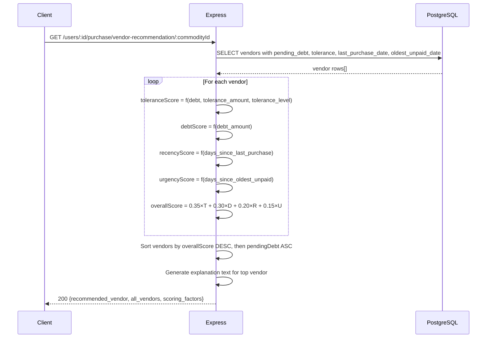
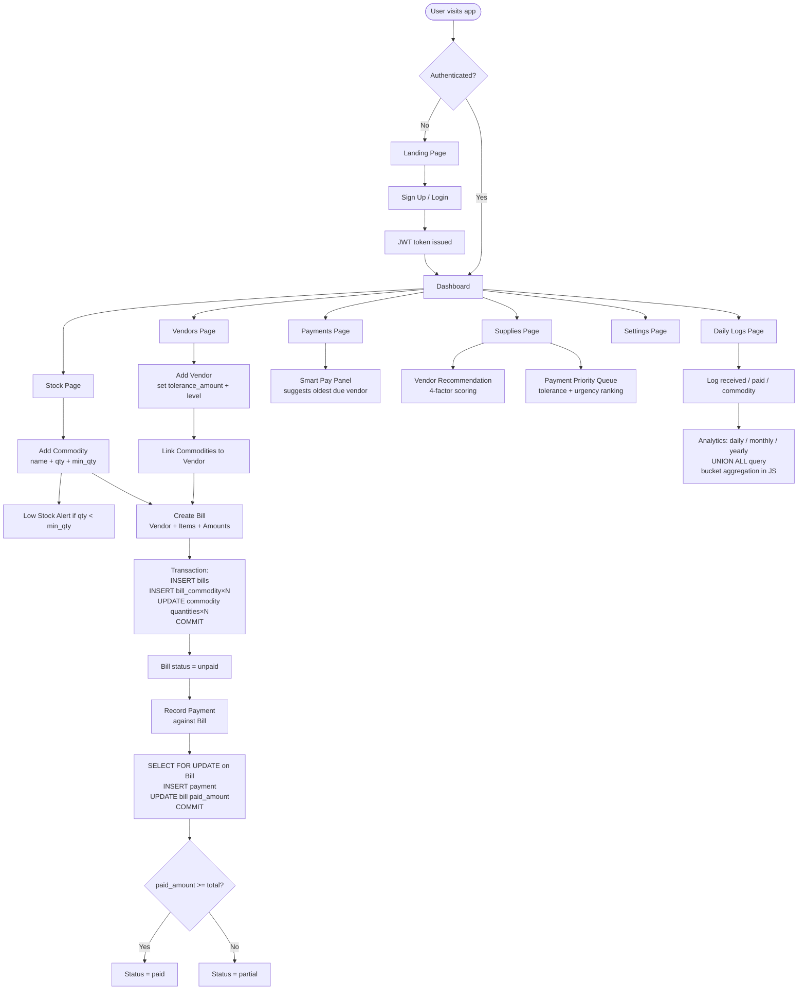

# 🏪 VendorFlow — Vendor & Purchase Management System

A full-stack web application for small retailers and shop owners to manage vendors, track inventory, record bills, log payments, and analyse daily cash flow — all in one place.

---

## 📋 Table of Contents

1. [Feature List](#-feature-list)
2. [Tech Stack](#-tech-stack)
3. [System Architecture](#-system-architecture)
4. [Database Design (ERD)](#-database-design-erd)
5. [UML — Class Diagram](#-uml--class-diagram)
6. [UML — Key Sequence Diagrams](#-uml--key-sequence-diagrams)
7. [Application Flow](#-application-flow)
8. [Vendor Scoring Algorithm](#-vendor-scoring-algorithm)
9. [API Reference](#-api-reference)
10. [Project Structure](#-project-structure)
11. [Environment Variables](#-environment-variables)
12. [Getting Started](#-getting-started)

---

## ✨ Feature List

### 🔐 Authentication
- User registration with bcrypt password hashing (cost factor 10)
- JWT-based login with 1-hour token expiry
- Protected routes via Bearer token middleware

### 👤 User Management
- Create, read, update, delete users
- Business profile management (business name, phone, address)

### 🏭 Vendor Management
- Add and manage multiple vendors per user
- Set **tolerance amount** (credit limit) and **tolerance level** (low / medium / high) per vendor
- Link vendors to the commodities they supply (many-to-many)

### 📦 Commodity / Inventory Management
- Track commodities with name, current quantity, minimum quantity threshold, and unit
- Automatic commodity name normalisation to lowercase
- Low-stock alerts when quantity falls below `min_quantity`

### 🧾 Bill Management (ACID Transactions)
- Create bills with line items — atomically inserts bill + all commodity line items + updates stock quantities in a single PostgreSQL transaction
- Bill status auto-computed: `unpaid` → `partial` → `paid`
- View bills per user or per vendor

### 💸 Payment Management
- Record payments against specific bills
- Payment modes: `cash` or `upi`
- Concurrent-safe payment recording using `SELECT ... FOR UPDATE` row locking
- Bill status auto-updated on every payment
- Smart payment suggestion — prioritises vendors with oldest unpaid bills and highest pending amounts

### 📊 Daily Log & Financial Analytics
- Manual cash-in / cash-out log entries (`received` / `paid` / `commodity`)
- Unified financial analytics combining payment records + daily logs via `UNION ALL`
- Three analytics views: **daily** (hourly buckets), **monthly** (daily buckets), **yearly** (monthly buckets)
- Auto-generated insights: cashflow trend, top vendor by spend, payment mode breakdown, concentration warnings

### 🤖 Smart Purchase Intelligence
- **Vendor Recommendation** — 4-factor weighted score to recommend the best vendor for a commodity
- **Bulk Purchase Optimisation** — distribute orders across multiple vendors to balance load and debt
- **Vendor Health Score** — categorise vendor relationships as excellent / good / moderate / critical
- **Payment Priority Queue** — rank vendors by urgency (tolerance breach + days waiting)
- **Low Stock Alerts** — list commodities below minimum quantity, sorted by shortage severity

---

## 🛠 Tech Stack

| Layer | Technology |
|---|---|
| **Backend Runtime** | Node.js v20 |
| **Backend Framework** | Express.js v5 |
| **Database** | PostgreSQL (hosted on Supabase, AWS ap-northeast-2) |
| **DB Client** | `pg` (node-postgres) with connection pooling |
| **Authentication** | JWT (`jsonwebtoken`) + bcrypt (`bcryptjs`) |
| **Frontend Framework** | React 19 + TypeScript 5.7 |
| **Frontend Build Tool** | Vite 7 |
| **UI Components** | Radix UI (headless) + Tailwind CSS v4 |
| **State / Data Fetching** | TanStack React Query v5 |
| **Forms** | React Hook Form + Zod validation |
| **Charts** | Recharts |
| **3D / Landing Page** | Three.js + @react-three/fiber + GSAP |

---

## 🏗 System Architecture

```
┌─────────────────────────────────────────────────────────────┐
│                        CLIENT (Browser)                      │
│                                                              │
│  React 19 + TypeScript + Vite                                │
│  ┌──────────┐ ┌──────────┐ ┌──────────┐ ┌──────────────┐   │
│  │Dashboard │ │ Vendors  │ │Payments  │ │  Daily Logs  │   │
│  │   Page   │ │   Page   │ │   Page   │ │    Page      │   │
│  └──────────┘ └──────────┘ └──────────┘ └──────────────┘   │
│                    TanStack React Query                       │
└────────────────────────┬────────────────────────────────────┘
                         │  HTTP/REST  (JSON)
                         │  Authorization: Bearer <JWT>
┌────────────────────────▼────────────────────────────────────┐
│                   BACKEND  (Node.js + Express)               │
│                        Port 3000                             │
│                                                              │
│  ┌────────────┐   ┌────────────────┐   ┌─────────────────┐  │
│  │Auth Routes │   │ Domain Routes  │   │  Purchase Routes│  │
│  │/register   │   │/users /vendors │   │ /low-stock      │  │
│  │/login      │   │/bills /payments│   │ /vendor-reco.   │  │
│  └────────────┘   │/daily-logs     │   │ /bulk-plan      │  │
│                   └────────────────┘   └─────────────────┘  │
│                                                              │
│  ┌──────────────────────────────────────────────────────┐   │
│  │              Middleware Pipeline                       │   │
│  │  CORS → JSON Parser → Auth Check → Error Handler     │   │
│  └──────────────────────────────────────────────────────┘   │
│                                                              │
│  ┌──────────────┐  ┌──────────────┐  ┌────────────────────┐ │
│  │  Controllers │  │   Services   │  │     Features       │ │
│  │  (request/   │  │ (SQL queries)│  │  (purchase.js SQL) │ │
│  │  response)   │  │              │  │                    │ │
│  └──────┬───────┘  └──────────────┘  └────────────────────┘ │
│         │  pg.Pool (max 10 connections)                       │
└─────────┼───────────────────────────────────────────────────┘
          │
┌─────────▼───────────────────────────────────────────────────┐
│              PostgreSQL  (Supabase — AWS Seoul)               │
│                                                              │
│  users  user_profiles  vendors  commodities                  │
│  vendor_commodity  bills  bill_commodity                     │
│  payments  daily_logs                                        │
│                                                              │
│  Indexes: 5 on daily_logs, 1 on payments (composite)        │
└─────────────────────────────────────────────────────────────┘
```

---

## 🗄 Database Design (ERD)

```mermaid
erDiagram
    users {
        uuid id PK
        text name
        text email UK
        text password
    }

    user_profiles {
        uuid user_id PK FK
        text business_name
        text phone_number
        text address
    }

    vendors {
        uuid id PK
        uuid user_id FK
        text name
        text phone_number
        integer tolerance_amount
        text tolerance_level
    }

    commodities {
        uuid id PK
        uuid user_id FK
        text name
        integer quantity
        integer min_quantity
        text unit
    }

    vendor_commodity {
        uuid vendor_id FK
        uuid commodity_id FK
    }

    bills {
        uuid id PK
        uuid vendor_id FK
        uuid user_id FK
        integer total_amount
        integer paid_amount
        text status
        text bill_url
        timestamp date
        timestamp updated_at
    }

    bill_commodity {
        uuid id PK
        uuid bill_id FK
        uuid commodity_id FK
        integer supplied_ammount
        text unit
        integer cost
        text name
    }

    payments {
        uuid id PK
        uuid user_id FK
        uuid vendor_id FK
        uuid bill_id FK
        integer amount
        text payment_mode
        timestamp payment_date
    }

    daily_logs {
        uuid id PK
        uuid user_id FK
        text log_type
        integer amount
        timestamp log_date
        text note
        timestamp created_at
    }

    users ||--o| user_profiles : "has one"
    users ||--o{ vendors : "owns"
    users ||--o{ commodities : "tracks"
    users ||--o{ bills : "creates"
    users ||--o{ payments : "makes"
    users ||--o{ daily_logs : "logs"
    vendors ||--o{ bills : "receives"
    vendors ||--o{ payments : "gets paid"
    vendors }o--o{ commodities : "vendor_commodity"
    bills ||--o{ bill_commodity : "has items"
    commodities ||--o{ bill_commodity : "appears in"
    bills ||--o{ payments : "paid via"
```

### Database Constraints

| Table | Constraint | Purpose |
|---|---|---|
| `users` | `UNIQUE(email)` | One account per email |
| `commodities` | `UNIQUE(name, user_id)` | No duplicate commodity names per user |
| `vendor_commodity` | `UNIQUE(vendor_id, commodity_id)` | No duplicate links |
| `daily_logs` | `CHECK(log_type IN ('received','paid','commodity'))` | Valid log types only |
| `payments` | `CHECK(payment_mode IN ('cash','upi'))` | Valid modes only |
| `daily_logs.amount` | `CHECK(amount > 0)` | Positive amounts only |
| All FK columns | `FOREIGN KEY REFERENCES` | Referential integrity enforced at DB level |

### Indexes

```sql
-- daily_logs — 5 indexes for analytics performance
CREATE INDEX idx_daily_logs_user_id       ON daily_logs (user_id);
CREATE INDEX idx_daily_logs_date          ON daily_logs (log_date DESC);
CREATE INDEX idx_daily_logs_type          ON daily_logs (log_type);
CREATE INDEX idx_daily_logs_user_date     ON daily_logs (user_id, log_date DESC);       -- composite
CREATE INDEX idx_daily_logs_user_type_date ON daily_logs (user_id, log_type, log_date DESC); -- composite

-- payments — composite for analytics UNION query
CREATE INDEX idx_payments_user_date       ON payments (user_id, payment_date DESC);
```

---

## 📐 UML — Class Diagram



---

## 🔄 UML — Key Sequence Diagrams

### 1. User Registration & Login



### 2. Bill Creation (ACID Transaction)



### 3. Concurrent Payment with Row Locking



### 4. Analytics Query Flow



### 5. Vendor Smart Recommendation



---

## 🔁 Application Flow



---

## 🤖 Vendor Scoring Algorithm

The smart vendor recommendation uses a weighted multi-factor score (0–100):

```
overallScore = (toleranceScore × 0.35)
             + (debtScore     × 0.30)
             + (recencyScore  × 0.20)
             + (urgencyScore  × 0.15)
```

### Score Breakdown

| Factor | Weight | How it's scored |
|---|---|---|
| **Tolerance compliance** | 35% | debt=0 → 100, within limit → 80, exceeded (high flex) → 60, exceeded (med) → 40, exceeded (low) → 20 |
| **Debt level** | 30% | ₹0 → 100, <₹1k → 80, <₹5k → 60, <₹10k → 40, ≥₹10k → 20 |
| **Purchase recency** | 20% | Never / >30 days → 100, >15 days → 70, >7 days → 50, ≤7 days → 30 |
| **Payment urgency** | 15% | No pending → 100, ≤15 days → 100, >15 days → 60, >30 days → 30, >60 days → 0 |

**Tiebreaker:** When two vendors have the same score, the one with lower pending debt wins.

### Vendor Relationship Health Categories

| Health | Condition |
|---|---|
| `excellent` | Zero pending debt |
| `good` | Debt within tolerance amount |
| `moderate` | Debt exceeds tolerance, but vendor has high flexibility |
| `critical` | Debt exceeds tolerance, low-flexibility vendor |

---

## 📡 API Reference

### Auth
| Method | Endpoint | Description |
|---|---|---|
| POST | `/register` | Register new user |
| POST | `/login` | Login, returns JWT |

### Users
| Method | Endpoint | Description |
|---|---|---|
| GET | `/users` | All users |
| GET | `/users/:id` | One user |
| POST | `/users` | Create user |
| PUT | `/users/:id` | Update user |
| DELETE | `/users/:id` | Delete user |
| GET | `/users/profiles` | All profiles |
| GET | `/users/:id/profiles` | User's profile |
| POST | `/users/:id/profiles` | Create profile |
| PUT | `/users/:id/profiles` | Update profile |

### Vendors
| Method | Endpoint | Description |
|---|---|---|
| GET | `/vendors` | All vendors (global) |
| GET | `/users/:userId/vendors` | User's vendors |
| GET | `/users/:userId/vendors/:id` | Single vendor |
| POST | `/users/:userId/vendors` | Create vendor |
| PUT | `/users/:userId/vendors/:id` | Update vendor |
| DELETE | `/users/:userId/vendors/:id` | Delete vendor |

### Commodities
| Method | Endpoint | Description |
|---|---|---|
| GET | `/users/:userId/commodities` | User's commodities |
| GET | `/users/:userId/commodities/:id` | Single commodity |
| POST | `/users/:userId/commodities` | Create commodity |
| PUT | `/users/:userId/commodities/:id` | Update quantity |
| DELETE | `/users/:userId/commodities/:id` | Delete commodity |

### Vendor–Commodity Links
| Method | Endpoint | Description |
|---|---|---|
| GET | `/users/:userId/vendors/:vendorId/commodities` | Commodities for vendor |
| GET | `/users/:userId/commodities/:commodityId/vendors` | Vendors for commodity |
| GET | `/users/:userId/commodities/:commodityId/vendor-suggestion` | Simple vendor suggestion (lowest pending first) |
| POST | `/users/:userId/vendors/:vendorId/commodities` | Link commodity to vendor |
| DELETE | `/users/:userId/vendors/:vendorId/commodities/:commodityId` | Unlink |

### Bills
| Method | Endpoint | Description |
|---|---|---|
| GET | `/users/:userId/bills` | All bills for user |
| GET | `/users/:userId/bills/:id` | Bill with line items |
| GET | `/users/:userId/vendors/:vendorId/bills` | Bills for a vendor |
| POST | `/users/:userId/bills` | Create bill (transactional) |
| PUT | `/users/:userId/bills/:id` | Update bill |
| DELETE | `/users/:userId/bills/:id` | Delete bill |

### Payments
| Method | Endpoint | Description |
|---|---|---|
| POST | `/users/:userId/payments` | Record payment (transactional, row-locked) |
| GET | `/users/:userId/payments` | All payments for user |
| GET | `/users/:userId/payment-suggestion` | Suggested vendor to pay next |
| GET | `/users/:userId/vendors/:vendorId/payments` | Payments to a vendor |
| GET | `/users/:userId/bills/:billId/payments` | Payments for a bill |

### Daily Logs & Analytics
| Method | Endpoint | Description |
|---|---|---|
| GET | `/users/:userId/daily-logs` | List logs (filter by type/date/limit) |
| POST | `/users/:userId/daily-logs` | Create log entry |
| DELETE | `/users/:userId/daily-logs/:logId` | Delete log |
| GET | `/users/:userId/daily-logs/analytics` | Analytics (daily/monthly/yearly view) |

### Smart Purchase Intelligence
| Method | Endpoint | Description |
|---|---|---|
| GET | `/users/:userId/purchase/low-stock-alerts` | Commodities below min_quantity |
| GET | `/users/:userId/purchase/vendor-recommendation/:commodityId` | Smart vendor score + recommendation |
| POST | `/users/:userId/purchase/bulk-plan` | Bulk purchase plan across multiple commodities |
| GET | `/users/:userId/purchase/analytics` | Purchase analytics per vendor |
| GET | `/users/:userId/purchase/vendor-health` | Vendor relationship health scores |
| GET | `/users/:userId/purchase/payment-priority` | Ranked payment priority list |

---

## 📁 Project Structure

```
DBMS/
├── backend/
│   ├── src/
│   │   ├── app.js                  # Express app entry point
│   │   ├── Controller/             # Request/response handlers
│   │   │   ├── auth.js
│   │   │   ├── users.js
│   │   │   ├── vendors.js
│   │   │   ├── commodities.js
│   │   │   ├── bills.js            # ACID transaction for bill creation
│   │   │   ├── payments.js         # Concurrent-safe payment with FOR UPDATE
│   │   │   ├── dailyLogs.js        # Analytics engine + UNION ALL query
│   │   │   ├── purchase.js         # Smart scoring & recommendation
│   │   │   ├── userProfile.js
│   │   │   └── vendorCommodity.js
│   │   ├── routes/                 # Express routers (10 modules)
│   │   ├── services/               # Raw SQL queries (parameterized)
│   │   ├── features/
│   │   │   └── purchase.js         # Complex SQL for purchase intelligence
│   │   ├── middlewares/
│   │   │   ├── authMiddleware.js   # JWT verification
│   │   │   ├── errorHandler.js     # Global error handler
│   │   │   └── validateUser.js
│   │   ├── utils/
│   │   │   └── billStatus.js       # Dynamic enum resolution + in-memory cache
│   │   └── db/
│   │       └── db.js               # pg.Pool connection
│   ├── db/
│   │   └── migrations/             # SQL migration files
│   ├── .env
│   └── package.json
│
└── frontend/
    ├── src/
    │   ├── App.tsx                 # React Router setup (public + protected routes)
    │   ├── pages/
    │   │   ├── LandingPage.tsx
    │   │   ├── LoginPage.tsx
    │   │   ├── SignupPage.tsx
    │   │   ├── DashboardPage.tsx
    │   │   ├── VendorsPage.tsx
    │   │   ├── StockPage.tsx
    │   │   ├── PaymentsPage.tsx
    │   │   ├── DailyLogsPage.tsx   # Full analytics UI (47KB)
    │   │   ├── SuppliesPage.tsx
    │   │   └── SettingsPage.tsx
    │   ├── components/             # Reusable UI components
    │   ├── context/                # AuthContext
    │   ├── hooks/                  # Custom React hooks
    │   └── lib/                    # API client utilities
    └── package.json
```

---

## 🔑 Environment Variables

### Backend (`backend/.env`)
```env
PORT=3000
DATABASE_URL=postgresql://<user>:<password>@<host>:5432/postgres
SUPABASE_URL=https://<project>.supabase.co
SUPABASE_ANON_KEY=<anon_key>
JWT_SECRET=<strong_random_secret_min_32_chars>
```

### Frontend (`frontend/.env`)
```env
VITE_API_BASE_URL=http://localhost:3000
```

---

## 🚀 Getting Started

### Prerequisites
- Node.js v18+
- A PostgreSQL database (local or Supabase)

### Backend Setup
```bash
cd backend
npm install
# Add your .env file with DATABASE_URL and JWT_SECRET
npm run dev        # starts with nodemon on port 3000
```

### Frontend Setup
```bash
cd frontend
npm install
npm run dev        # starts Vite dev server
```

### Database Setup
Run the migration files in order:
```bash
# In your PostgreSQL client or Supabase SQL editor:
# 1. Create your tables (users, vendors, commodities, bills, etc.)
# 2. Run migration files:
psql $DATABASE_URL -f backend/db/migrations/2026-04-13_daily_logs_table.sql
psql $DATABASE_URL -f backend/db/migrations/2026-04-13_daily_logs_analytics_indexes.sql
```

---

## 📊 Key Design Decisions

| Decision | Choice | Reason |
|---|---|---|
| Database | PostgreSQL | Relational data, ACID transactions, FK constraints |
| Money storage | `INTEGER` (whole rupees) | Avoids floating-point precision errors |
| Bill creation | Wrapped in `BEGIN/COMMIT` | Atomic — all items or none |
| Payment concurrency | `SELECT ... FOR UPDATE` | Prevents double-payment race condition |
| Analytics source | `UNION ALL` (payments + daily_logs) | One query, two sources, no deduplication overhead |
| Vendor scoring | Weighted JS computation | Readable, testable, no complex SQL expressions |
| Connection management | `pg.Pool` | Reuses connections across requests (default max: 10) |
| Password hashing | `bcrypt` cost factor 10 | ~100ms per hash — brute-force impractical |
| Bill status | Dynamically resolved from DB enum | Adapts to schema changes without code updates |


